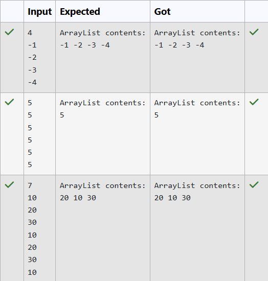

# Ex11 Convert HashSet to ArrayList in Java
## DATE: 16-09-2026
## AIM:
To convert a collection of distinct integers stored in a HashSet into an ArrayList and display its contents.
## Algorithm
1. Start the program.
2. Create a `HashSet` to store a collection of distinct integers.
3. Add a few integers to the `HashSet`.
4. Create an `ArrayList` and initialize it with the elements of the `HashSet`.
5. Display the elements of both the `HashSet` and the `ArrayList`.
6. Stop the program.
 

## Program:
```
/*
Program to To convert a collection of distinct integers stored in a HashSet into an ArrayList and display its contents.
Developed by: Elavarasan M
RegisterNumber: 212224040083 
*/
```

```java
import java.util.*;

public class HashSetToArrayList {

    public static ArrayList<Integer> convertToArrayList(HashSet<Integer> set) {
        ArrayList<Integer> list = new ArrayList<>(set);
        return list;
    }

    public static void main(String[] args) {
        Scanner sc = new Scanner(System.in);
        int n = sc.nextInt();
        HashSet<Integer> set = new HashSet<>();
        for (int i = 0; i < n; i++) {
            int num = sc.nextInt();
            set.add(num);
        }

        ArrayList<Integer> list = convertToArrayList(set);
        System.out.println("ArrayList contents:");
        for (int num : list) {
            System.out.print(num + " ");
        }
        sc.close();
    }
}
```
## Output:



## Result:
The program successfully converts a collection of distinct integers stored in a HashSet into an ArrayList
