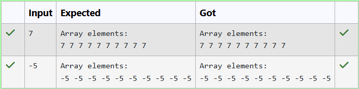

# Ex13 Fill the First 10 Elements of an Array with a Constant using Arrays.fill()
## DATE: 16-09-2026
## AIM:
To write a Java program that fills the first 10 elements of an array with a constant value using the Arrays.fill() method.
## Algorithm
1. Start the program.
2. Create an integer array of a specified size, for example, 15 elements.
3. Use the `Arrays.fill()` method to fill the first 10 elements of the array with a constant value.
4. Display the elements of the array after filling.
5. Stop the program.

## Program:
```
/*
Program to FILL the first 10 elements of an array with a constant value using the Arrays.fill() method.
Developed by: Elavarasan M
RegisterNumber: 212224040083 
*/
```
```java
import java.util.*;

public class FillArrayUsingArraysFill {

    public static int[] fillArray(int size, int value) {
        int[] arr = new int[size];
        Arrays.fill(arr, value);
        return arr;
    }

    public static void main(String[] args) {
        Scanner sc = new Scanner(System.in);
        int value = sc.nextInt();
        int[] arr = fillArray(10, value);
        System.out.println("Array elements:");
        for (int num : arr) {
            System.out.print(num + " ");
        }
        sc.close();
    }
}
```
## Output:



## Result:
The program successfully fills the first 10 elements of the array with the constant value 5 using the Arrays.fill() method.
