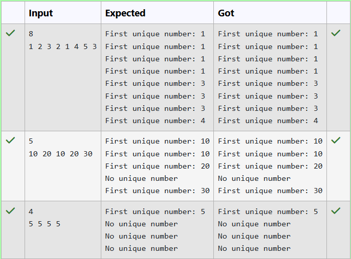

# Ex14 Tracking the First Unique Number in a Stream using LinkedHashMap
## DATE: 16-09-2026
## AIM:
To implement a program that tracks the first unique (non-repeating) number in a stream of integers using a LinkedHashMap.

## Algorithm
1. Start the program.
2. Create a `LinkedHashMap` to store integers as keys and their frequency (count) as values.
3. Read or define a stream of integers as an array of numbers.
4. For each integer in the stream:

   1. If the number is not already present in the map, insert it with `count = 1`.
   2. If the number already exists, increment its count by `1`.
5. After processing each element, traverse the `LinkedHashMap` to find the first number with a count of `1`.
6. Display the current stream and the first unique number.
7. Repeat the process for each element in the stream.
8. Stop the program.


## Program:
```
/*
Program to tracks the first unique (non-repeating) number in a stream of integers using a LinkedHashMap.
Developed by: Elavarasan M
RegisterNumber: 212224040083 
*/
```
```java
import java.util.*;

public class FirstUniqueNumberStream {

    public static void processStream(int n, Scanner sc) {
        LinkedHashMap<Integer, Integer> freqMap = new LinkedHashMap<>();
        for(int i=0; i<n; i++){
            int current = sc.nextInt();
            
            freqMap.put(current, freqMap.getOrDefault(current, 0)+1);
            
            int fUniq = -1;
            
            for(Map.Entry<Integer, Integer> entry : freqMap.entrySet()){
                if(entry.getValue() == 1){
                    fUniq = entry.getKey();
                    break;
                }
            }
            
            if(fUniq != -1){
                System.out.println("First unique number: "+fUniq);
            }else{
                System.out.println("No unique number");
            }
        }
    }

    public static void main(String[] args) {
        Scanner sc = new Scanner(System.in);
        int n = sc.nextInt();
        processStream(n, sc);
        sc.close();
    }
}
```
## Output:



## Result:
The program successfully tracks and returns the first unique number at any point in the integer stream using a LinkedHashMap.
